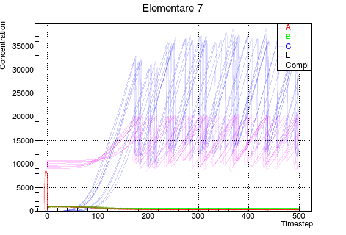

# Elementare 7 

* no random initialization of concentrations
* no random change of values after division


## Elementare 7.1
* random change on initialization default values (step 1 instead of 0) _is it correct?_
* random change of values after division

__random change__ is between [-10%; +10%]


## Elementare 7.2 (more steps)



### Volume
```c++
    float ro =7.87870e+22;
    float delta = 1e-8;
    float delta3 = pow(delta,3);
   
    float L = rr_ -> getValue("L");
    double newVolume = (1.0/6.0)*M_PI*delta3*pow(sqrt((L/(ro*M_PI*delta3)) -1.0/3.0)-1 ,3 );
    //std::cout <<newVolume<<std::endl;
    rr_ -> setValue("compartment",newVolume*1000);
```
__Species multiplied by 0.353553391 after division:__ A, B, Compl, C
### TO FIX
__UpdateSpecies()__ not implemented, still raises errors during runtime
this function should correct values of different species at runtime

__Visualization of Comp__ the visualization of this specie raises errors, maybe it goes overflow at runtime

__Variable Comp not affected by any random change__ due to runtime error

