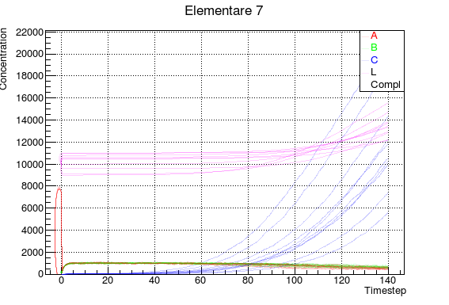

# Elementare 7 

* no random initialization of concentrations
* no random change of values after division

## Elementare 7.1
* random change on initialization default values (step 1 instead of 0) _is it correct?_
* random change of values after division

__random change__ is between [-10%; +10%]

## Elementare 7.2 (more steps)

### TODO
Fix __MultiplyAllSpecies__ 
### TO FIX
__UpdateSpecies()__ not implemented, still raises errors during runtime
this function should correct values of different species at runtime

__Visualization of Comp__ the visualization of this specie raises errors, maybe it goes overflow at runtime

__Variable Comp not affected by any random change__

