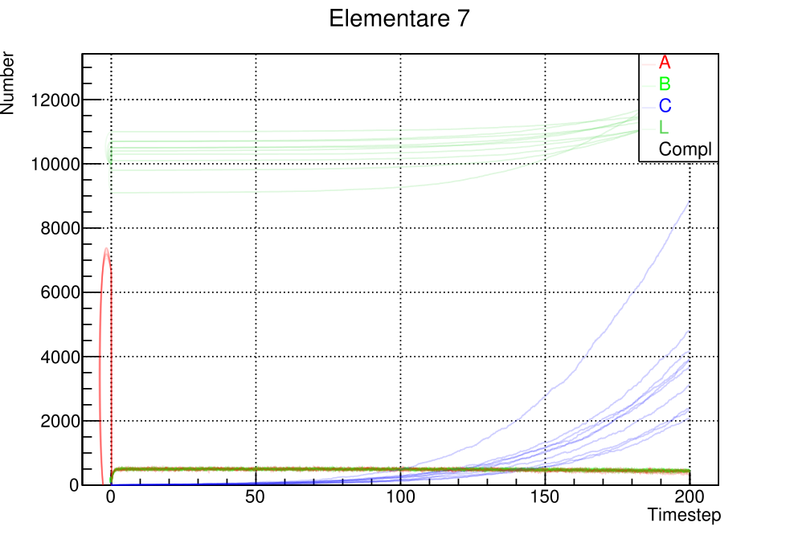
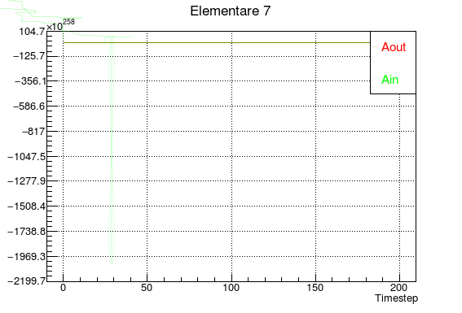

# Elementare 8

__TODO__: "elementare 7" as title it's a typo, they're all related to elementare 8

* random change on initialization default values (step 1 instead of 0)
* random change of values after division

__random change__ is between [-10%; +10%]

__plot of ABCL__

## Errors in visualization of other species

__Aout, Bin, Bout__

__Aout, Bin, Bout__

__TODO__  
* finish completely cell division code (not all species are inherited, doesn't matter for this example because division doesn't happen).
* finish __MultiplyAllSpecies__
