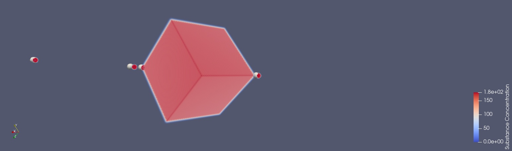
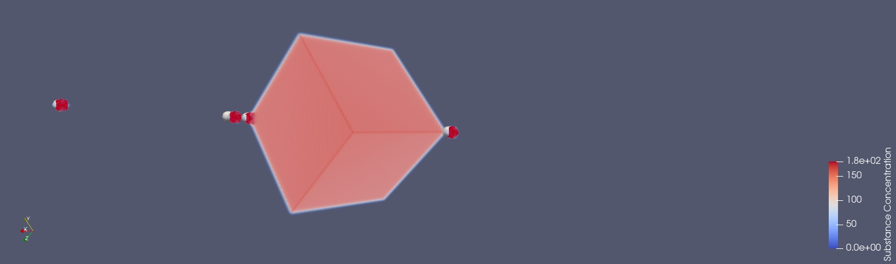
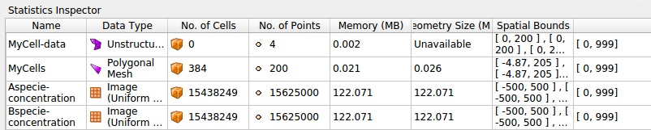
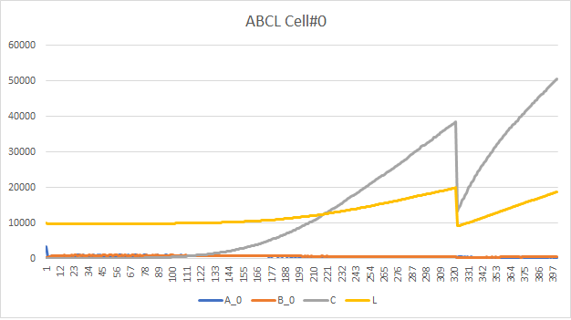
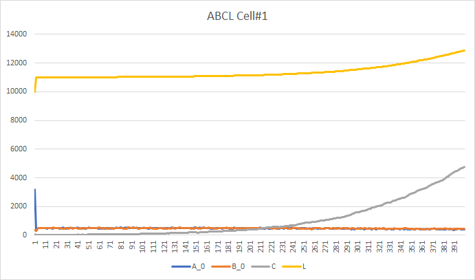
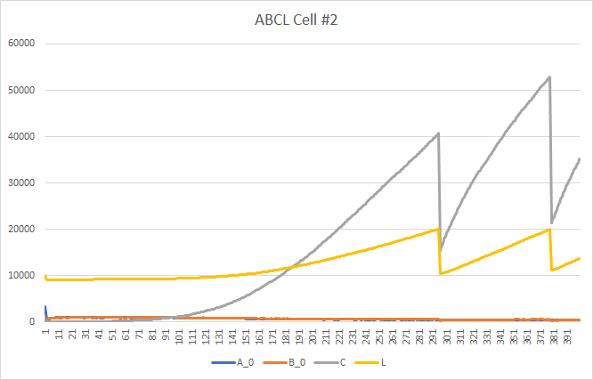
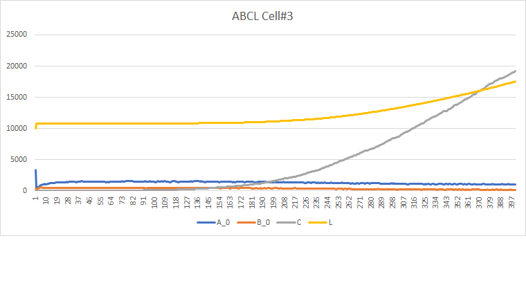

# Elementare 8

__NOTE__: 

* _random change_ on initialization default values (step 1 instead of 0)
* _random change_ of values after division
* A_ingresso, A_uscita, B_ingresso, B_uscita set to 0 after integration
* Aext and Bext are changed as follows __[Aext]' = ([Aext]*Volume-A_netto)/Volume__ and __[Bext]' = ([Bext]*Volume-A_netto)/Volume__
* the substances in the environment are changed by the amount A_netto and B_netto

* __random change__ is between [-10%; +10%] appliet to A, B, C, L

## Cell positions

## Cell positions with A and B in the environment

__Note__: A and B are cubes, they're just not completely well renderized

## After few steps

## After about 100 steps

# Memory usage
the following statistics shows how the substances use a very large amount of memory 

# Some graph of single cell metabolism

### Cell 0

### Cell 1

### Cell 2

### Cell 3

__TODO__  
* Implement inheritance of sbml module (daughter cells have no module at the moment)
