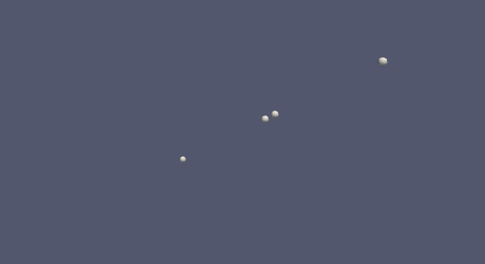
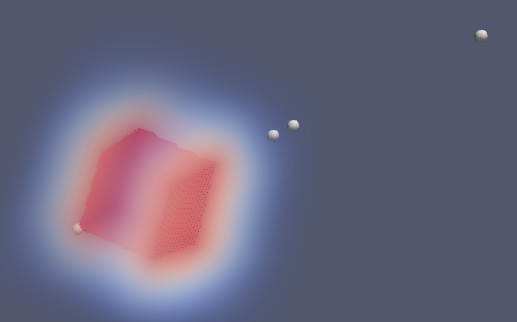
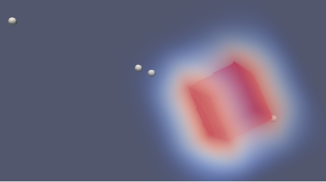
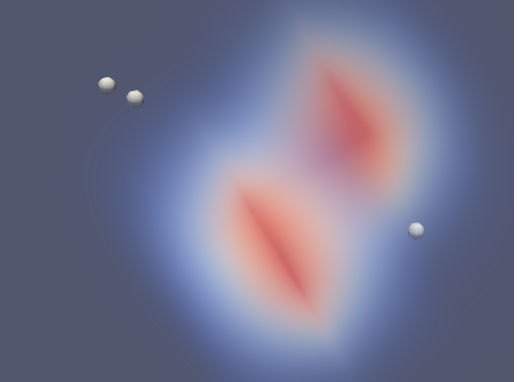

# Elementare 8

__NOTE__: 

* _random change_ on initialization default values (step 1 instead of 0)
* _random change_ of values after division
* no changes applied to A_ingresso, A_uscita, B_ingresso, B_uscita
* Aext and Bext are increased if the cell is near a substance but 10 of the substance each step
* the substances is decreased with the amount "eaten" by the cell

* __random change__ is between [-10%; +10%] appliet to A, B, C, L

## Cell positions

## Cell positions with A and B in the environment

__Note__: A and B are cubes, they're just not completely well renderized

## step 0

## After some step

# Major problem to fix ASAP
Susbtances A and B are not both cubes, for some unidentified reason B does not come out as cube

# Some graph of single cell metabolism

### Cell 0

### Cell 1

### Cell 2

### Cell 3

__TODO__  
* Implement inheritance of sbml module (daughter cells have no module at the moment)
* set _A_ingresso, A_uscita, B_ingresso, B_uscita_ to 0 after division 
* Does the cell expel some substance?
* How to check the parameters A-ingresso Aext-A; B-ingresso Bext-B; B-uscita B_Bext; A-uscita A_Aext 
  and how they should be modified
* The species to multiply by 0.3... after division are just A,B,C?
