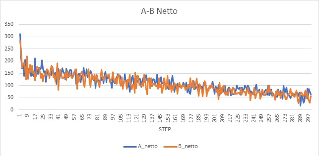
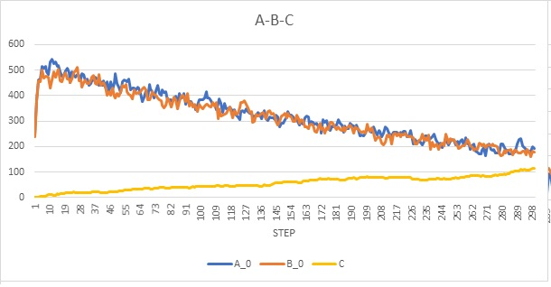

# Elementare 8

__NOTES__: 

* _random change_ on initialization default values (step 1 instead of 0)
* _random change_ of values after division
* A_ingresso, A_uscita, B_ingresso, B_uscita set to 0 after integration
* A_netto = A_ingresso - A_uscita tells us what is the amount of A that the cell consumes or ejects in the environment. (same for B_netto)
* Aext and Bext are changed as follows __[Aext]' = ([Aext]*Volume-A_netto)/Volume__ and __[Bext]' = ([Bext]*Volume-B_netto)/Volume__
* the substances in the environment are changed by the amount A_netto and B_netto

* __random change__ is between [-10%; +10%] appliet to A, B, C, L

## Cell positions

## Cell positions with A and B in the environment

## After few steps

## After about 100 steps

# Memory usage
the following statistics shows how the substances use a very large amount of memory.
Parameters of the substances: 
* resolution: 250
* diffusion coefficient: 0.0005
* decay costant: 0

The duration of entire simulation was about __15 minutes__ 

# Some graph of a single cell metabolism

Since A_netto and B_netto are positive in the simulation with 300 steps the behaviour of the cell eating some substances in the environment doesn't appear.

So every cell has the same graph.

### A_netto and B_netto production 

### Metabolism of A-B-C

__TODO__  
* Implement inheritance of sbml module (daughter cells have no module at the moment)
