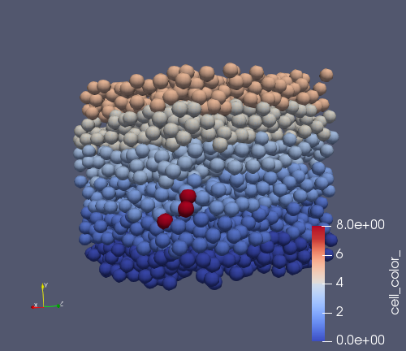

# hello_world
The code of this example is based on [tumor concept](https://github.com/BioDynaMo/biodynamo/tree/master/demo/tumor_concept) from BioDynaMo demos
# Result
The result of this simulation should look like the picture below.
Cells have a different color for each layer and the red ones are the tumor cells

