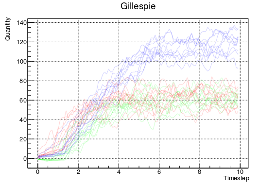

# sbml_cell_test
Simple test of the sbml_integration demo but with a different sbml model

## SBML MODEL  

### Species

| name | boundary conditions | initial amount | 
|------|---------------------|----------------|
| Xo | true | 100 |
| S1 | false | 0 |
| S2 | false |0 |
| S3 | false | 0 |
| X1 | true | 0 |

### Parameters

|id  | value |
|----|-------|
|k1  | 15  |
|k2  | 14   |
|r1  | 0.75  |

### Reactions
| name |reactants/products|  math |
|-----|----| ---- |
|J1 | Xo &rarr; S1| X0 * r1 |
|J2 | S1 &rarr; S2 | S1 + k1 |
|J3 | S2 &rarr; S3 | S2 + k2 |
|J4 | S3 &rarr; X1 | S3*r1 - k1|

### Gillespie integration

### Continous integration

